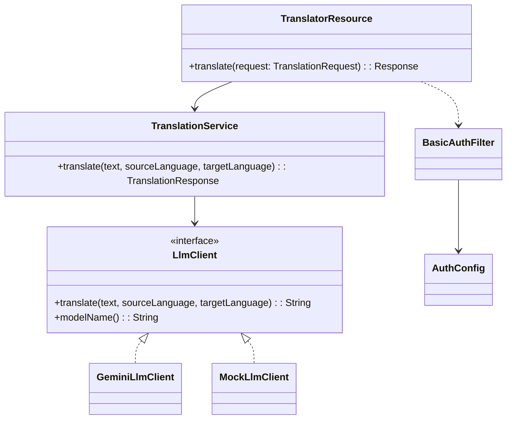
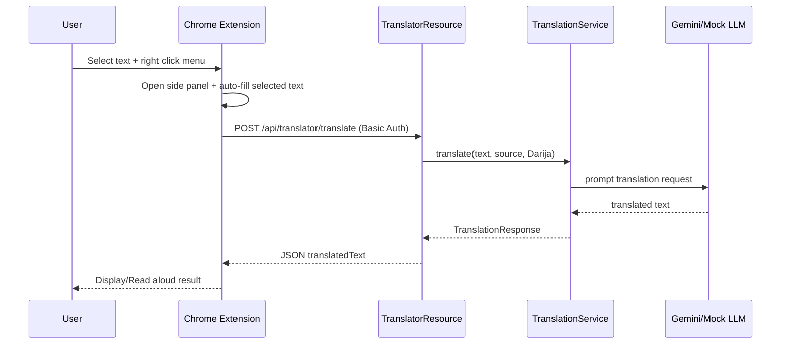

# Technical Architecture (UML)

## 1) Class Diagram


## 2) Sequence Diagram (Chrome Extension to backend)


## 3) Deployment Diagram
```mermaid
flowchart LR
    subgraph Client_Side
      Browser[Chrome + Extension]
      Python[Python Client]
      PHP[PHP Client]
      Mobile[React Native App]
    end

    subgraph Server_Side
      REST[Jakarta REST Service\n(Grizzly/Jersey)]
      Auth[Basic Auth Filter]
      LLMClient[GeminiLlmClient / MockLlmClient]
    end

    Browser --> REST
    Python --> REST
    PHP --> REST
    Mobile --> REST

    REST --> Auth
    REST --> LLMClient
    LLMClient --> Gemini[(Google Gemini API)]
```
